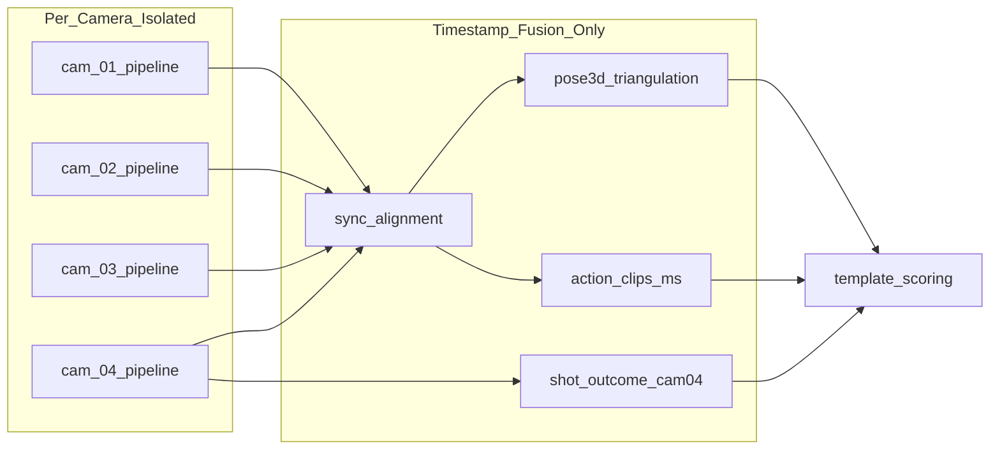

> **⚠️ 历史计划稿（勿作现行架构）**  
> 请改读：**[系统架构与 Pipeline](./系统架构与Pipeline.md)** · [文档索引](./README.md)  
> 下文保留仅供对照早期路线图；其中「进球 stub / YOLOX 默认 / 无 event_sync」等描述 **已过时**。


# 篮球课堂系统架构 — 实施计划

> 更新：2026-07-07  
> 落地文档：[`docs/系统架构与Pipeline.md`](docs/系统架构与Pipeline.md)

---

## 1. 机位规划

| 硬件编号 | 配置 ID | 位置 | 视野 | 独立 pipeline 输出 |
|----------|---------|------|------|-------------------|
| 摄像头 1 | `cam_01` | 左边线 | **整个三分区域**（左） | `perception/cam_01/` |
| 摄像头 2 | `cam_02` | 右边线 | **整个三分区域**（右） | `perception/cam_02/` |
| 摄像头 3 | `cam_03` | 底线 | **罚球点**专注 | `perception/cam_03/` |
| 摄像头 4 | `cam_04` | 篮筐区 | 筐、出手、**进球** | `perception/cam_04/` |

---

## 2. 核心架构：按机位分离

### 2.1 问题

四路相机可能启动/停止时间不同、帧率或丢帧不同、总帧数不一致。  
**Stage 4 不能假设 `frame_idx` 跨机位相等。**

### 2.2 方案



每路 pipeline 输出：本地 `frame`、`timestamp_ms`、`camera_meta.json`。

---

## 3. 系统分层

| 层 | 模块 | 职责 |
|----|------|------|
| L0 | Consent / Audit / Retention | 合规与留存 |
| L1 | Recorder ×4 | 独立文件；`sync_meta` 记录 offsets |
| L2 | **Per-camera perception** | YOLOX + RTMW + Face-Body ReID |
| L3 | **Temporal alignment** | `alignment.json` + clip 跨机位映射 |
| L4 | Pose2Sim 3D | 时间戳采样 → 三角化 → 视角无关角 |
| L5 | Rule action segmenter | 主责机位；多 clip；`start_ms`/`end_ms` |
| L6 | Shot outcome (cam_04) | 篮球/投篮模型（未来） |
| L7 | Template scoring | 3D 角 + 参考模板 + 可选进球 |
| L8 | Report / UI | 报告与教师端 |

---

## 4. Pipeline 详述

### Stage 4 — 逐机位感知

```python
# src/perception/camera_pipeline.py
for cam in [cam_01, cam_02, cam_03, cam_04]:
    run_single_camera_perception(session_id, cam)
```

输出：

```
perception/cam_03/
  detections.jsonl   # student_id, face_sim, body_sim, timestamp_ms
  pose2d.json
  camera_meta.json
```

ReID 配置见 `configs/cameras.yaml` → `identity.gallery_match_cost_threshold`。

### Stage 5 — 时间对齐

- 锚定机位默认 **cam_03**
- `align_clips_across_cameras(anchor_cam, start_ms, end_ms)`
- `max_drift_ms` 融合窗口（默认 200ms）

### Stage 6 — 3D 融合

- 按 `timestamp_ms` 从各机位取最近帧关键点
- Pose2Sim 三角化（**当前为 stub，待替换**）
- demo 单视频用伪 3D 抬升仅作可视化

### Stage 7 — 规则动作切分

算法（`src/action/detect.py`）：

1. 右手腕 #10 高度局部最小值 → release 候选
2. 手腕须高于双肩与鼻子（排除运球/接球）
3. 50 帧内峰值合并为一次出手
4. 相邻出手间隔 ≥ 45 帧

按 `configs/zones.yaml` 的 `primary_camera` 选输入序列。

### Stage 8 — 进球判定（cam_04，未来）

```yaml
# configs/cameras.yaml cam_04
future_models:
  ball_detector: null
  shot_classifier: null
```

当前：`src/shot/outcome.py` stub。

### Stage 9 — 评分

- 动作规范：`configs/actions/*.yaml`
- 参考骨架：`data/templates/curry_free_throw.json`（H36M-17 四阶段）
- 用 `phase.start_ms` 在 3D `angles` 中查最近时间样本

---

## 5. 单视频 Demo 验证路径

已与正式 pipeline **解耦**，用于算法验证与可视化：

| 脚本 | 用途 |
|------|------|
| `scripts/validate_demo_video.py` | 单视频感知 + 动作 + 评分 + 可视化 |
| `scripts/process_curry_demos.py` | 批量处理库里两视频 + 生成三维模板 |
| `scripts/test_reid_gallery.py` | ReID 首帧 gallery 匹配测试 |
| `scripts/verify_gpu_env.py` | 环境与权重检查 |

规范输出（`src/demo/output_layout.py`）：

```
data/model_raw_data/outputs/<slug>/
  report.json | annotated.mp4 | phases.mp4 | angles.png
  pose_seq.json | keyframes/shot{N}_{phase}.jpg
```

---

## 6. 代码结构

```
src/
  cameras/           registry, temporal
  perception/        camera_pipeline, rtmlib_backend
  identity/          enrollment, tracker, embedders
  action/            detect, segmenter
  pose/              pose2sim_wrapper, angles, reference_template
  shot/              outcome (stub)
  scoring/           fusion, templates
  demo/              output_layout
  orchestrator/      session_pipeline
configs/
  cameras.yaml       四机位 + identity 参数
  zones.yaml         区域 ↔ 主责机位
  actions/           罚篮/上篮/三威胁评分模板
data/
  templates/         curry_free_throw.json
  model_raw_data/outputs/   demo 可视化产物
```

---

## 7. 接口契约

| 生产者 | 消费者 | 载荷 |
|--------|--------|------|
| cam_X perception | temporal | `pose2d.json` + `timestamp_ms` |
| temporal | pose3d | `alignment.json` |
| temporal | action | clip `start_ms`/`end_ms` |
| pose3d | scoring | `angles.json` |
| action | scoring | `actions/*.json` |
| templates | scoring | `data/templates/*.json` |
| shot (cam_04) | scoring | `shot_outcomes/outcomes.json` |

---

## 8. 实施路线

| 阶段 | 目标 | 状态 |
|------|------|------|
| P0 | 四机位配置 + 独立感知 + 时间对齐 | ✅ |
| P1 | ReID + 规则动作 + demo 输出规范 | ✅ |
| P2 | 库里罚篮 3D 参考模板 | ✅ |
| P3 | Pose2Sim 真三角化 + 双视角角一致性 | 待做 |
| P4 | cam_04 篮球检测 + 进球模型 | 未来 |
| P5 | 上篮/三威胁 zone 模板 + UI | 未来 |

---

## 9. 风险与对策

| 风险 | 对策 |
|------|------|
| 四路帧数不同 | 独立 pipeline + timestamp 融合 |
| 时钟漂移 | `camera_time_offsets_ms` + Pose2Sim synchronize |
| 三分区多人 | cam_01/02 ROI + body ReID |
| 运球误检为出手 | 手腕高于肩/颈 + 峰值合并 |
| ReID 侧脸漏匹配 | 动态 α + 课前多样本注册 |
| 进球模型未就绪 | stub 输出；评分暂不依赖进球 |

---

## 10. 交付物索引

| 文档/配置 | 路径 |
|-----------|------|
| 架构说明 | `docs/系统架构与Pipeline.md` |
| 本计划 | `docs/系统架构与pipeline.plan.md` |
| 机位配置 | `configs/cameras.yaml` |
| 区域配置 | `configs/zones.yaml` |
| 库里罚篮模板 | `data/templates/curry_free_throw.json` |
| Demo 产物索引 | `data/model_raw_data/outputs/manifest.json` |
